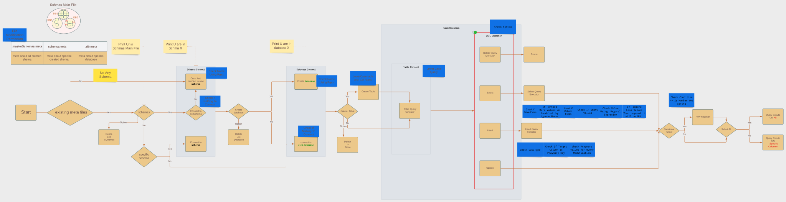

# DBMSBashScript
The Project aim to develop DBMS, that will enable users to store and retrieve the data from Hard-disk.
>## **Code Flow:**
- Code Flow is a description of how the program is  Work

>## **Features:**
- **Connect to current Folder *Automatically* Based On Meta Type** 
  - **.masterSchemas.meta** refers To Master Scehma (Master Scehma Contain a hierarchy of schemas and databases ) 
  - **.schema.meta** refers To Scehma Folder ( Scehma Folder Contain a hierarchy of databases )
  - **.db.meta** refers To DataBase Folder ( DataBase Folder Contain a hierarchy of Tables Files )
  - **No Any OF THE ABOVE** refers To that the Folder you in is an Empty Folder So You Can Create a Master Scehma Folder
  
+ **Any OF THe Above Types Have (DELET, LIST, CREATE, And CONNECT)** Methods

- **db.meta** IS the ONLY Type Which Contain a Query NAVIGATOR Method 

+ **Query NAVIGATOR** Redirect the Givin Query To the right method (SELECT, INSERT, DELETE, and UPDATE ) to Excute 

- **BONUS** THE QUERY IS WRITEN AS REAL DBMS MANNER

>## **Code File system:**
- `start.sh`  Contain The index Main Method and the Required Files
- `masterSchemas.sh` Contain Schemas Methods
- `databaseMethods.sh` Contain Database Methods
- `tablesMethods.sh` Contain Tables Methods
- `queryMethods.sh` Contain Query Methods
- `customMethods.sh` Contain a Methods Used for All File (EX: **ReadInteger**(Use To read integer))
- `globalVariables.sh` Contain a GlobalVaribes Used for All File (EX: **NAMEREGEXP**(Use To Check Enterd Name))
- `colors.sh` Contain a Colors Variables 
